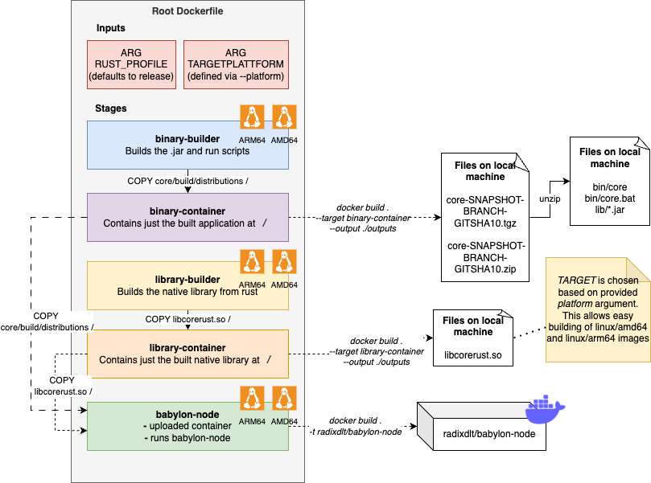

# Development Environment Setup

## Getting Prepared

### Installing dependencies

Main dependencies:
- Java 17.0.4+ SDK installed and configured. It's very important to have at least 17.0.4, else you will hit Java Compiler bugs.
- Latest [stable rust installed](https://www.rust-lang.org/tools/install) - if you hit any rust compilation issues, try `rustup update` and try again.

If you wish to launch a local network through Docker:
- Docker version 20.10+
- `docker-compose` version 1.25+

Please note that many installations require a shell restart to work effectively (due to `$PATH` etc).
`cargo` may even require a full system reboot to allow a successful initial build.

### Getting the code

As an external contributor, if you intend to contribute, fork the [main repository](https://github.com/radixdlt/babylon-node) into your account and then clone it locally.

If an internal contributor, simply clone the main repository.

### Branching strategy

We follow the git-flow branch management model. Typically, you should branch off the `develop` branch and put a PR up merging back into the `develop` branch.

## Developing

### Building code

Use the following command to build binaries and run unit tests:

```shell
$ ./gradlew clean build
```

### Running integration tests

Integration tests take quite a while to run (over an hour on most machines).

They are typically run as part of a PR.

```shell
$ ./gradlew runAllIntegrationTests
```

### Running code formatting

The following formats the Java and Rust code, and should be run before putting up a PR:

```shell
$ ./gradlew spotlessApply
```

### Running the code

There are various strategies the node is run / tested:

#### Single validator, persistent DB (native)

For basic running, you can use the `Run Single Validator` command in IntelliJ, or alternatively, run the following:

```
$ RADIXDLT_HOST_IP_ADDRESS=127.0.0.1;RADIXDLT_NODE_KEY=AAAAAAAAAAAAAAAAAAAAAAAAAAAAAAAAAAAAAAAAAAY= ./gradlew :core:run --info
```

This runs a single validor node natively, which is enough for most testing.

Note that this runs with an auto-created database at `./core/RADIXDB`. Whenever you pull, don't forget to delete that folder
before attempting to run the node, as during Babylon development, we make no guarantees around database schema compatibility.

#### Local network, transient DB (docker)

If you wish to run a local network, this is best done in Docker - see [../docker](../../docker).

Note that the docker build can take a while, so it may be easier to use a native running approach instead.

#### Integration tests (native)

To test edge cases, or specific areas, the integration tests are a great place to look / develop.
Take a look at tests beginning `REv2` for some examples of how these can be configured.

#### Radix shell (native)

For certain kinds of manual testing, running a [radix shell](../../shell) can be the easiest.

This allows programmatically spinning up, configuring and connecting natively-running nodes together.

### IntelliJ IDEA Troubleshooting

In some cases IntelliJ IDEA may deny to load project properly. Usually this happens if you have installed more than one Java version.
If you meet this issue, check following configuration options:
 - `Project Structure -> Project Settings -> Project`, make sure `Project SDK` and `Project Language Level` is set to `17 (Preview) - Pattern matching for switch`.
 - `Project Structure -> Project Settings -> Modules`, make sure that every module has `Language Level` set to `17 (Preview) - Pattern matching for switch (Project default)`  
 - `Settings -> Build, Execution, Deployment -> Build Tools -> Gradle`, make sure that `Gradle JVM` is set to `Project JDK`. 

### Building with docker




The application can be build using a single Dockerfile:

```
docker build . -t radixdlt/babylon-node 
```

If local testing is required, the artifacts can be produced locally with docker aswell by specifying the build target and outputting the result. 

The different targets are:
- `binary-builder` - the container that builds the application. Target this to debug any errors during the build process of the java application
- `binary-container` - an empty container with only the java build artifacts.
- `library-builder` - the container that builds the application. Target this to debug any errors during the build process of the rust application/library
- `library-container` - an empty container with only the rust build artifacts. This is a library necessary for the java application to run

- `app-container` - (default) a container that runs the babylon-node application with all dependencies installed. Configuration still needs to be added by the user. See `docker/node-1.yml` for an example configuration.

Example core-rust/libcorerust.so:

```
docker build  . \
    -t radixdlt/babylon-node:local-test-core-rust \
    --target library-container \
    --output ./outputs
ls outputs 
libcorerust.so
```

Example core/java-binary/*.jar

```
docker build  . \
    -t radixdlt/babylon-node:local-test-core \
    --target binary-container \
    --output ./outputs
ls outputs 
core-SNAPSHOT-<BRANCH>-<GITSHA10>.tgz 
core-SNAPSHOT-<BRANCH>-<GITSHA10>.zip
```