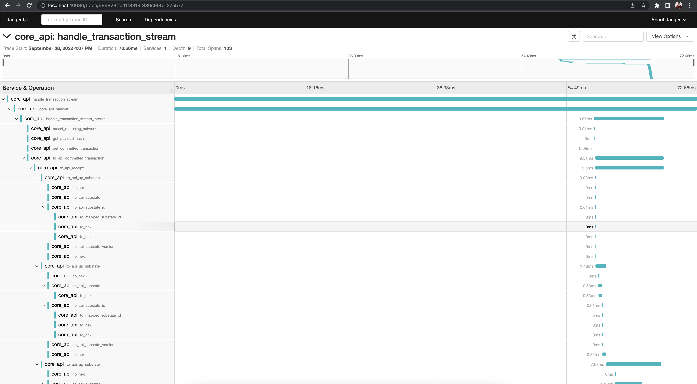

# Guidelines for logging in Rust

The goal of recording tracing information is twofold:
- make us able to notice high-severity anomalies, like the events marked with "error", "warning" severity
- aid the debugging by recording low-severity events and spans, like recording
  function calls, their parameters, and so on

## Summary

- Use the `tracing` crate
- Annotate any function of your choosing with the `#[tracing::instrument]`
  attribute (the most basic annotation is the
  `#[tracing::instrument(skip_all)]` )
- Don't worry about the performance overhead, yet

## Status
As of 2022-09-29, the `tracing_subscriber::fmt` is active unconditionally,
which prints every "error", "warning", "info", and "debug" to the `stderr`,
similarly to the Java logger.

Depending on the `JAEGER_AGENT_ENDPOINT` environment variable, and optional
`opentelemetry_jaeger` subscriber can be activated, see below for more
information.

This is subject to change, and we should figure out how can we collect the
tracing in a production environment, and answer questions like what should be
the retention time, what details should be redacted, and so on.

As of 2022-09-30, tracing instruments for each severity are compiled in (i.e.
the low-severity logging calls are in the binaries) in each build target. The
impact of this is not measured, yet, but once a suspicion arises this might be
an issue, the following remedy exists:
- [Disable certain severities during compilation time](https://docs.rs/tracing/latest/tracing/level_filters/index.html#compile-time-filters)

## Rationale
It is unfeasible to prepare for any future debugging scenario (otherwise why
don't you prevent those bugs?), and these can be attached later as well, so do
not spend way too much effort on logging, just enough that makes your future
life easier.

Focus on creating small functions with descriptive name, and attach the
previously mentioned `instrument` attribute (which creates a `span` with the
name of the function).

The benefit/cost ratio of these annotations are rather high, as they require
little to no additional maintenance.

## Common `#[tracing::instrument]` use-cases
Consider this section as a hand-picked version of
[this](https://docs.rs/tracing/latest/tracing/attr.instrument.html) , and
consult with the latest documentation for more information.

- [`instrument(skip(foo, bar))`, `instrument(skip_all)`](https://docs.rs/tracing/latest/tracing/attr.instrument.html#skipping-fields)
  When you don't want to record a parameter (called foo, or bar), or any of them.
- [`instrument(level = "error")`, `instrument(level = "debug")`](https://docs.rs/tracing/latest/tracing/attr.instrument.html#examples-2)
  Increase (or decrease) the severity of the span.
- [`instrument(ret)`, `instrument(err)`, `instrument(ret(Display))`, `instrument(err(Debug))`,](https://docs.rs/tracing/latest/tracing/attr.instrument.html#examples-2)
  Capture the return of a function (or the Err path of a `Result`) with the
  `Debug` trait (`ret`, `err(Debug)`) or with the `Display` trait
  (`ret(Display)`, `err`)

## Emitting events

`instrument` emits a `span`, which is:
> Unlike a log line that represents a moment in time, a span represents a period of time with a beginning and an end.

You can emit traditional log lines as well:
> An Event represents a moment in time. It signifies something that happened while a trace was being recorded.

The `tracing::{info, warn, error, trace, debug}` work pretty much the same as
their equivalent in the `log` crate, but can be used for structured logging as
well. 
Check [this section](https://docs.rs/tracing/latest/tracing/index.html#using-the-macros) for more information.

Personally, I would prefer the generated spans from the `instrument`
attributes, as they are less likely to lie in the future (i.e. they are less
likely the subject of software rot).

## See also
There is a section in the `rustc` development guide
[Using tracing to debug the compiler](https://rustc-dev-guide.rust-lang.org/tracing.html).
It is not completely how we use `tracing`, yet, but it is useful to see how can
you hunt for bugs in a mature project.

## Additional thoughts
This section is a bit unstructured, subject to change, but can help with some practical usage, and debugging.

## Log collecting practices
While you can modify the `RUST_LOG` envvar to make the
`tracing_subscriber::fmt` print better logs to the stderr ( see the directives
[here](https://docs.rs/tracing-subscriber/latest/tracing_subscriber/filter/struct.EnvFilter.html#directives)),
I found that rather tedious, as you have to modify the envvar, and restart some
docker containers, so:

### I've seen one of your cool-looking traces and I want it, too!

An example of Jaeger tracing configured locally:



There is a proof of concept subscriber which reports all tracing to [Jaeger](https://www.jaegertracing.io/) .

Start a jaeger in the same network
```
docker rm -f jaeger;
docker run -d --name jaeger \
  -e COLLECTOR_ZIPKIN_HTTP_PORT=9411 \
  -p 5775:5775/udp \
  -p 6831:6831/udp \
  -p 6832:6832/udp \
  -p 5778:5778 \
  -p 9411:9411 \
  -p 14268:14268 \
  -p 16686:16686 \
  --network docker_five_nodes \
  jaegertracing/all-in-one:1.6
```
Adjust the `JAEGER_AGENT_ENDPOINT` environment variable in `docker/core.yml`:
```diff
diff --git a/docker/core.yml b/docker/core.yml
index ba8d873e1..def8dc9ea 100644
--- a/docker/core.yml
+++ b/docker/core.yml
@@ -13,7 +13,7 @@ services:
       RADIXDLT_GENESIS_DATA: ${RADIXDLT_GENESIS_DATA}
       JAVA_OPTS: -server -Xmx512m -Xmx512m -XX:+HeapDumpOnOutOfMemoryError -XX:+AlwaysPreTouch -Dguice_bytecode_gen_option=DISABLED -Djavax.net.ssl.trustStore=/etc/ssl/certs/java/cacert
s -Djavax.net.ssl.trustStoreType=jks -Djava.security.egd=file:/dev/urandom -Dcom.sun.management.jmxremote.port=9011 -Dcom.sun.management.jmxremote.rmi.port=9011 -Dcom.sun.management.jmxr
emote.authenticate=false -Dcom.sun.management.jmxremote.ssl=false -Djava.rmi.server.host
name=core -agentlib:jdwp=transport=dt_socket,address=*:50505,suspend=n,server=y --enable-preview
       # Adjust the following envvar for trace collection
-      # JAEGER_AGENT_ENDPOINT: jaeger:6831
+      JAEGER_AGENT_ENDPOINT: jaeger:6831
     # May need updating for Babylon
     image: radixdlt/radixdlt-core:main
     labels:
```
And start: `./docker/scripts/rundocker.sh 5`

Inspect the recorded traces at `http://localhost:16686/search` .
